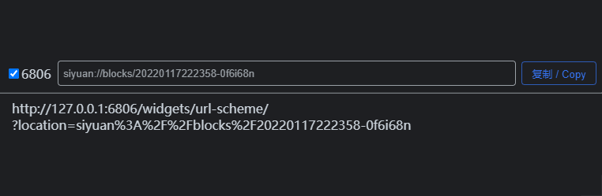

# URL Scheme 挂件 | widget-url-scheme

> 本项目从 [DiamondYuan/302](https://github.com/DiamondYuan/302) *[MIT License](https://github.com/DiamondYuan/302/blob/main/LICENSE)* 分叉, 感谢原作者 [DiamondYuan](https://github.com/DiamondYuan) :heart:  This project forked from [DiamondYuan/302](https://github.com/DiamondYuan/302) *[MIT License](https://github.com/DiamondYuan/302/blob/main/LICENSE)*, thanks to the original author [DiamondYuan](https://github.com/DiamondYuan) :heart:.

一个可将 URL Scheme 转换为 HTTP 302 重定向地址的挂件  
A widget that converts the URL Scheme to HTTP 302 redirection.

## 相关参考文章 | RELATED REFERENCE ARTICLES

- [在任意网站支持 URL Scheme - 少数派 / Support URL Scheme on any website - sspai](https://sspai.com/post/66896)
- [总结：url scheme 相关 · 语雀 / Summary: url scheme related · yuque](https://www.yuque.com/deerain/gannbs/gmkp9w)

## 预览 | PREVIEW

## 功能 | FUNCTION

- 将 `URL Scheme` 转换为 `HTTP URL`  
  Convert `URL Scheme` to `HTTP URL`.
  - 输入 `URL Scheme` 后单击 <kbd>复制 / Copy</kbd> 按钮将转换后的 `HTTP URL` 写入剪贴板  
    After entering the `URL Scheme`, click the <kbd>复制 / Copy</kbd> button to write the converted `HTTP URL` to the clipboard.
  - 输入 `URL Scheme` 后单击 <kbd>回车</kbd> 键将转换后的 `HTTP URL` 写入剪贴板  
    After entering the `URL Scheme` and click <kbd>Enter</kbd> key to write the converted `HTTP URL` to the clipboard.
- 将 `HTTP URL` 重定向至 `URL Scheme`  
  Redirect `HTTP URL` to `URL Scheme`.
  - 在浏览器中访问 `HTTP URL` 将重定向至 `URL Scheme`  
    Redirect to `URL Scheme` when accessing `HTTP URL` in the browser.
- 跟随全局主题更改颜色 | Follow the global theme to change the color.

## 开始 | START

### 自动 | AUTO

该挂件已在[思源笔记社区集市](https://github.com/siyuan-note/bazaar)上架, 可直接在集市中安装  
The widget has been put on the shelves at [SiYuan community bazaar](https://github.com/siyuan-note/bazaar) and can be installed directly in the Bazaar.

### 手动 | MANUAL

1. 在 [Releases](https://github.com/Zuoqiu-Yingyi/widget-url-scheme/releases) 中下载发行包, 解压后放到[思源笔记](https://github.com/siyuan-note/siyuan)`<工作空间>/data/widgets/` 目录下  
   Download the release package in [Releases](https://github.com/Zuoqiu-Yingyi/widget-url-scheme/releases), unzip it and place it in the `<workspace>/data/widgets/` directory of [SiYuan Note](https://github.com/siyuan-note/siyuan).
2. 在笔记中创建一个 `IFrame` 块, 地址填 `/widgets/widget-url-scheme` 即可  
   Create an `IFrame` block in your notes with the address filled in `/widgets/widget-url-scheme`.

## 更改日志 | CHANGE LOG

[CHANGE LOG](./CHANGELOG.md)
